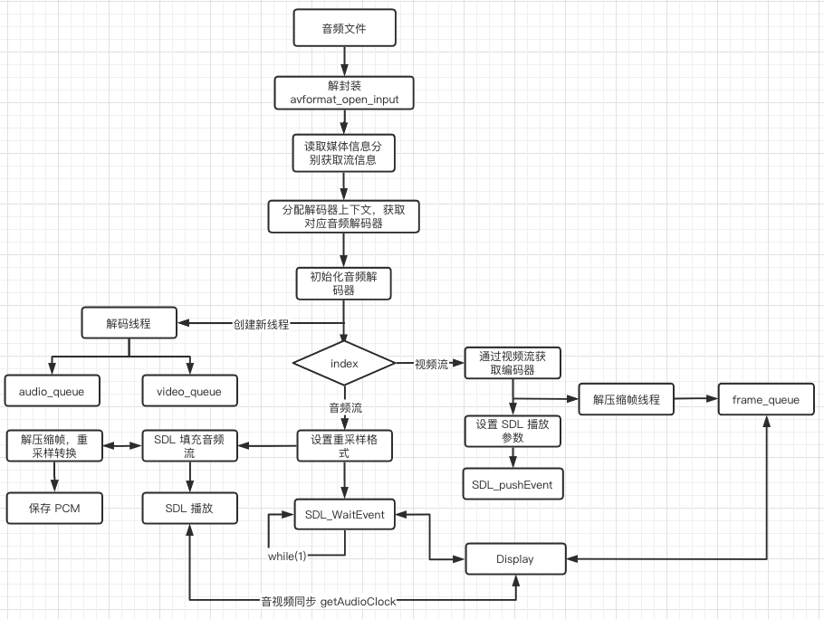
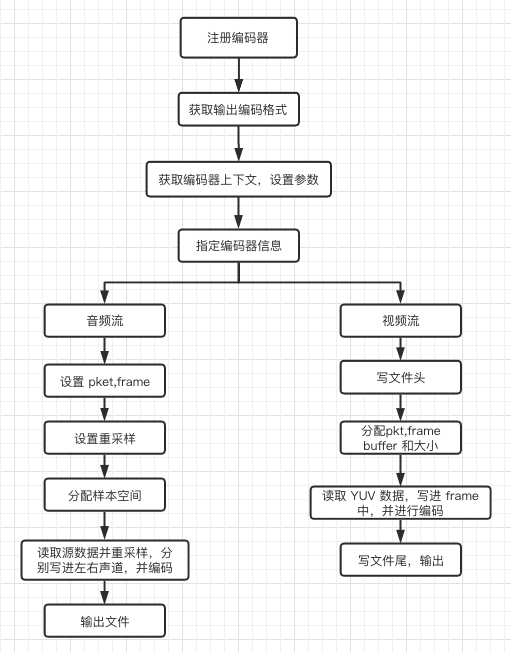

# ffmpeg 学习

### 音频解码流程和 demo，通过 SDL2 播放
ffmpeg 在对音频文件进行解码主要有以下流程
* 通过 avformat_open_input 读取文件信息和数据格式等信息保存到上下文句柄中，
通过句柄得到音频流 index.
* 创建解码器上下文句柄，然后将音频流导入进句柄中，并创建解码器.
* 创建解码线程进行取帧，将读取到的压缩帧按照 index 放入对应的帧队列里。
* 设置 SDL 参数和重采样参数，由于原始音频文件的格式不一可能在播放的出问题，
所以通过重采样统一格式进行输出播放。
* SDL 回调线程里面进行解压缩帧并且播放。
* 将解码后的音频原始数据保存为 pcm 数据。

### 视频解码流程和 demo，通过 SDL2 播放
ffmpeg 在解码视频文件的时候和音频文件类似，不同的是视频文件需要主要 pts 和 dts，一般在处理时间戳
的时候都是获取的 pts 即播放时候的时间戳，pts 与实际的时间戳通过 av_q2d（time_base）* pts 来得到的。
* 前面获取流数据和解码器的流程和音频一样。
* 在解压缩帧线程里，要将该帧的 pts 保存在帧队列里面以便在播放的时候同步音视频
* 播放时采用的是 YUV420 的方式进行显示，宽高采用原视频的宽高，YUV420 采用 1个 Y 分量公用一组 UV 分量。
* 主线程里面等待 SDL 事件并按照指定的时间进行刷新显示，当显示当前一帧的时候计算当前的 pts 和音频的时间差值，确定下一帧的显示是要延迟显示还是提前显示，以达到音视频同步播放的效果。
* 保存 YUV 格式，因为 4 个 Y 分量公用 1 组 UV 分量，所以 Y 分量在保存的时候是宽度*高度的数据，UV 分别保存 1/4 的数据数据。



### 音频编码流程，将 PCM 格式编码成 mp3
编码时首先确定需要编码的格式，按照输出参数设置不同的值，比如 mp3 编码器在设置的时候需要设置成 AV_SAMPLE_FMT_S16P，即左右声道的数据分别保存，而 packet 类型的需要交替保存。
* 注册所有的编解码器，查找指定的编码器，分配编码器上下文。
* 按照输出格式进行参数设置，码率，采样率，采样格式，通道数等，初始化编码器。
* 初始化 packet 和 frame 以及保存左右声道的 buffer 并分配空间，按照输出格式进行重采样参数设置。
* 按照采样数据大小从源文件读取，将读取到的数据进行重采样然后分别保存在左右声道 buffer 中.
* 对 frame 里的数据进行编码压缩，并写进文件中。

### 视频编码流程，将 YUV 格式编码成 h264
视频编码不同与音频的是在设置完成编码参数之后需要将编码器的上下文信息写进文件头。并且 YUV 的读取按照指定 YUV 格式进行读取数据，比如 YUV420 格式的，如果是 planra，则每次读取 3/2 的宽高大小。
* 获取输出文件的输出格式(可通过后缀名判断)，通过 avio_open 以只写的方式读取文件。
* 根据输出格式信息创建输出流，分配编码器上下文，编码器 Id等一系列参数。其中编码器可以自己指定类型，在 H264 编码的时候可以根据操作系统的不同指定 GPU 对应的编码器。
* 创建 packet，frame 已经保存 yuv 数据的缓冲区并按照宽高分配大小。
* 从输入文件中按照 3/2 宽高大小读取数据，分别写进 Y，U，V data 中，同时进行编码，将编码后的 packet 格式写进 avformatCtx 中。
* 编码完成后刷新下缓冲区确定没有缓冲数据，并且将文件尾写入，输出得到 h264 文件。



### 写 demo 过程中遇到的坑
1. 在播放音频的时候出先 dst/src image bad 的报错，一般出现这种情况是重采样的输入或者输出格式设置的不对，输入格式错误是在获取通道布局的时候一直是 0，所以重采样的时候拿不到所以报错，这种读不到通道布局
或者读取不到通道数的文件，可以通过通道数和通道布局的关系进行获取。
2. SDL 在播放的时候有杂音。这种情况一般是 SDL 播放的数据有问题，可以通过 fwrite 写文件的方式，将播放数据写进文件中查看波形图得到是否是数据问题。后面得知数据确实是有问题，原因在于每一次重采样后的数据
都会按照 SDL 回调的大小 2048 进行拷贝，而源数据大小为 44100Hz 采样率，2通道，采样大小为 1152，数据格式为 S16 的 mp3 文件，那么采样一次的大小就为 1152*2*2 = 4608，在两次回调后剩余的大小还有 4608-4096=512 字节的大小
没有被写入，这样等下一次回调的时候就可能只会播放者 512 的字节，所以播放的时候会听到杂音。如果等到剩余不够 2048 时应该取取帧等到，然后记录上一次的 index，然后去帧后 index 置再去拷贝 SDL，这样就不会有杂音问题了。
    ```
    void fill_audio(void *opaque, uint8_t *stream, int len)
    {
        AudioState *audioState = static_cast<AudioState*>(opaque);
        int available = 0;
        int write_len = 0;
        int written_len = 0;
        SDL_memset(stream, 0, len);
        while (len > 0) {
            if (audioState->bufferindex >= audioState->audiolen) {
                audioState->bufferindex = 0;
                audioState->decodeAudio();
                continue;
            }
    
            available = audioState->audiolen - audioState->bufferindex;
            write_len = available > len ? len : available;
    
            memcpy(stream, audioState->audiopos + audioState->bufferindex, write_len);
    #ifdef PCM
            fwrite(audioState->audiopos + audioState->bufferindex, 1, write_len, out_pcm);
    #endif
            stream += write_len;
            audioState->bufferindex += write_len;
            len -= write_len;
        }
    }

3. 音视频播放不同步。对于音视频不同步的问题网上各种各样的方法，但是可能都考虑的比较多，所以有的比较复杂，大多数都是以音频为基准进行同步。其实同步的关键点就两个，音频快了，视频加快刷新，不用按照之前设置的时间去进行，而是直接 pushevent，
视频快了就按照之前 2 倍或更慢的速度去播放当前帧。具体做法就是每次播放视频的时候都可以获取基于真实时间戳的 pts，然后拿到 pts 后就去获取音频正在播放的时间，接下来就按照之间的关键点去选择视频快放还是慢放就行了。
    ```
    double currentpts = *static_cast<double*>(frame->opaque);
    double del = currentpts - framelastpts;
    if (del <= 0 || del >= 1.0)
        del = framelastpts;

    framelastpts = currentpts;
    double refclock = AudioState::getInstance()->getAudioClock();
    double diff = currentpts - refclock;
    double threshold = (del > SYNC_THRESHOLD) ? del : SYNC_THRESHOLD;
    fprintf(stdout, "diff = %f, del = %f, currentpts = %f\n", diff, del, currentpts);

    if (fabs(diff) < NOSYNC_THRESHOLD) {
        if (diff < -threshold)
            del = 0;
        else if (diff >= threshold)
            del *= 2;
    }

    video_refresh(del * 1000);
    sws_scale(vpconvertctx, static_cast<const uint8_t *const *>(frame->data), frame->linesize, 0, pCodecCtx->height,
              frameYUV->data, frameYUV->linesize); //视频像素格式和分辨率的转换

    SDL_UpdateTexture(sdltexture, &sdlrect, frameYUV->data[0], frameYUV->linesize[0]);
    SDL_RenderClear(sdlrender);
    SDL_RenderCopy(sdlrender, sdltexture, nullptr, &sdlrect);
    SDL_RenderPresent(sdlrender);

4. 音频编码成 mp3 时找不到 mp3 编码器。ffmpeg 由于版权等原因可能不会内置一些编解码器，这是就要查看是否支持该类型的编解码器，可以在代码中获取当前的编解码类型是否有对应的编解码器，或者通过命令进行查看
     ``` 
   AVCodec *id = av_codec_next(nullptr); // 传 nullptr 的时候表示第一个节点
   while (id) {
       std::this_thread::sleep_for(std::chrono::microseconds(10000));
       printf("id.name = %d, %d\n", id->id, AV_CODEC_ID_MP3);
       if (id->id == AV_CODEC_ID_MP3) { // 查找当前解码器格式是否存在
           if (id->encode2 != nullptr) // 查看当前编解码器格式是解码器的还是编码器的
               break;
       }
       id = id->next;
   }
   ```
   * 命令方式：`ffmpeg -codecs | grpe mp3` 如果前面只有 `D.AIL. mp3adu` 则只有 mp3 的解码器，没有编码器
   
    这时应该去下载 libmp3lame 编码器，源码下载编译完成之后，将 libmp3lame.so 放在 ffmpeg 能够调用到的地方，重新配置 ffmpeg 然后重新编译 
    ``` 
   ./configure --enable=libmp3lame
     make -j4
   ```
  
    通过命令 `ffmpeg -codecs | grep mp3` 看到如果前面编程 DEAIL.mp3 就是支持编码器了。
   
5. 视频解码成 yuv 后格式保存，如果按照 yuv420 进行保存时，应该明白如何分别保存 yuv 各个分量，对于 Y 分量，一个 Y 的大小应该是 width*height，一对 UV 分别是 width*height/4 的大小，但是如果直接通过 fwrite 的方式进行存储可能数据会有问题，
这时候应该一个 n*height 去保存，每次保存 n*width(n 为 1 或者 1/2)。
    ```
    int linesizeY = frame->linesize[0];
    int linesizeU = frame->linesize[1];
    int linesizeV = frame->linesize[2];
   
    uint8_t *Y = frame->data[0];
    uint8_t *U = frame->data[1];
    uint8_t *V = frame->data[2];
   
   
    for (int i = 0; i < frame->height; i++) {//1176
        fwrite(Y, 1, static_cast<size_t>(frame->width), fp);
        Y += linesizeY;
    }
    for (int i = 0; i < frame->height / 2; i++) {//3072
        fwrite(U, 1, static_cast<size_t>(frame->width / 2), fp);
        U += linesizeU;
    }
    for (int i = 0; i < frame->height / 2; i++) {//2048
        fwrite(V, 1, static_cast<size_t>(frame->width / 2), fp);
        V += linesizeV;
    }
6. 解码音视频的时候出现 "Could not update timestamps for skipped samples"，这时应该将解码器的 timebase 设置为流的 timebase。 `codeCtx->pkt->time_base = stream->time_base`。
7. SDL 在渲染视频的时候一定要在主线程中，不然会播放不出来。

代码地址：https://github.com/Atom-pro/ffmpeg-demo
    